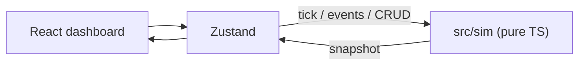

# Agent Collective

Interactive **multi-agent** simulator: a deterministic TypeScript engine driving a live React Flow dashboard. Six roles claim work, talk along a graph, fail, recover, and get better over time.

[](https://github.com/d0npedro/multi-agent/actions/workflows/ci.yml)
[](LICENSE)
[](https://www.typescriptlang.org/)
[](https://vite.dev/)
[](https://multi-agent-six-murex.vercel.app)

**[Live demo](https://multi-agent-six-murex.vercel.app)** · **[Usage](docs/usage.md)** · **[Architecture](docs/architecture.md)** · **[Deploy](docs/deployment.md)**


## Why this exists

Most “multi-agent” demos hide the loop behind a chat API. This one does the opposite: the **world is a testable state machine**. The UI is a cockpit. You can step a single tick, inject a resource shock, and watch the collective reroute — without a backend.

## What you see

A default collective of Coder, Researcher, Trader, Monitor, Creative, and Critic, already wired as a workflow graph.

| Live graph | Chaos and recovery |
| --- | --- |
|  |  |

- **Graph** — drag nodes, draw edges, status by color (idle / working / failed).
- **Clock** — play, pause, step, 1×–8×.
- **Events** — resource shortage, market shift, targeted agent failure.
- **Scenarios** — save the graph to `localStorage`, load it later.


Operator walkthrough, including metrics, resources, and the task board: **[docs/usage.md](docs/usage.md)**.

## Architecture

The engine owns truth. Each tick mutates `SimState`; Zustand publishes a clone; React Flow and the side panels render that snapshot.



```
src/sim/          domain — tick, agents, tasks, events, metrics
src/store/        adapter — play/pause, selection, scenario I/O
src/components/   view — graph + dashboard
docs/             usage, architecture, deploy, screenshots
.github/          CI + PR template
```

Details and the tick sequence: **[docs/architecture.md](docs/architecture.md)**.

## Quick start

```bash
git clone https://github.com/d0npedro/multi-agent.git
cd multi-agent
npm install
npm run dev
```

Open the URL Vite prints (usually `http://localhost:5173`). Press **Play**, then **4×**.

```bash
npm test              # engine tests (no browser)
npm run lint
npm run build         # production, base /
npm run preview
```

## Stack

React 19 · Vite 8 · TypeScript · React Flow · Zustand · Vitest · Vercel.

The simulation layer has **zero** UI imports. Seeded RNG keeps runs reproducible.

## Docs

| Doc | Contents |
| --- | --- |
| [Usage](docs/usage.md) | Clock, graph, agents, events, scenarios |
| [Architecture](docs/architecture.md) | Layers, tick loop, domain model |
| [Deployment](docs/deployment.md) | Vercel root + `/multi-agent/` subpath |
| [Contributing](CONTRIBUTING.md) | Where to change what |
| [Changelog](CHANGELOG.md) | What shipped |

Regenerate README screenshots against a running dev server:

```bash
npm run screenshots
```

## License

[MIT](LICENSE) © d0npedro
