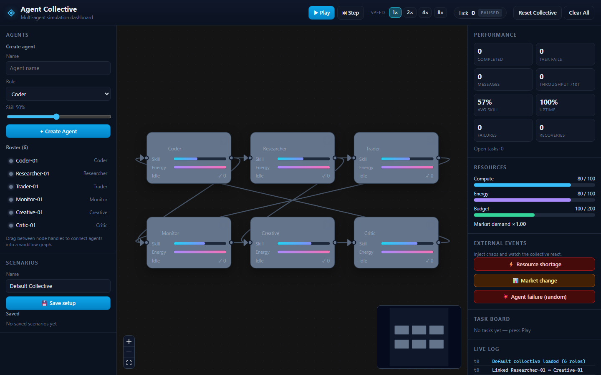
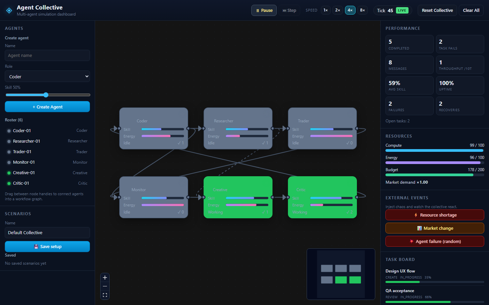
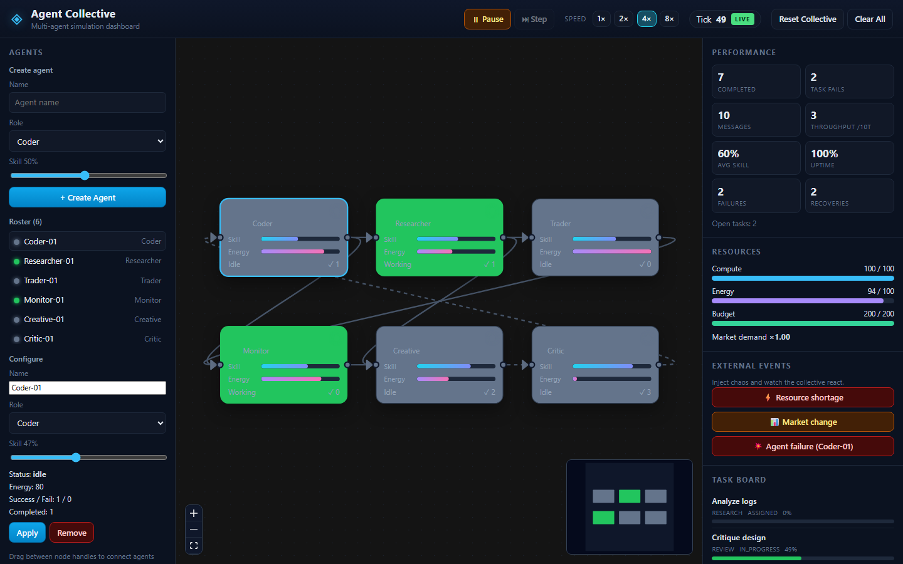
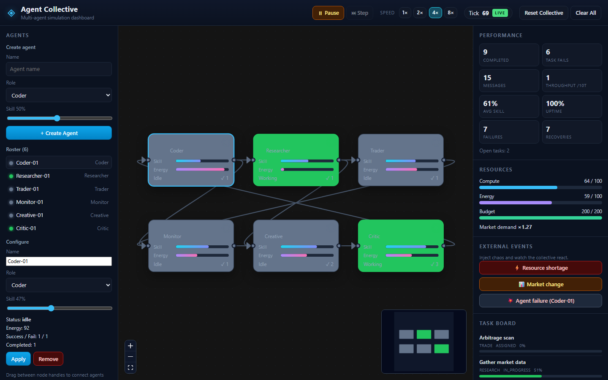

# Agent Collective

Interactive multi-agent AI collective simulator with a live node-graph dashboard.

Agents (Coder, Researcher, Trader, Monitor, Creative, Critic) claim tasks, message along connections, fail and recover, and improve skill over time. Inject external events and watch the collective react.



## Repository

- **Default branch:** `main`
- **GitHub:** https://github.com/d0npedro/multi-agent
- **Clone:** `git clone https://github.com/d0npedro/multi-agent.git`
- **Production (Vercel):** https://multi-agent-six-murex.vercel.app

## Stack

- React + Vite + TypeScript
- Pure TypeScript simulation engine (testable without React)
- React Flow graph canvas
- Zustand app store
- localStorage scenario save/load
- Vitest unit tests
- Vercel static hosting (`vercel.json`)

## Run

```bash
npm install
npm run dev
```

Open the URL Vite prints (usually `http://localhost:5173`).

```bash
npm test              # unit tests (simulation engine)
npm run build         # production build (base `/`)
npm run build:subpage # production build for /multi-agent/ subpath
npm run preview       # serve production build
```

## Using the simulator

The app is a single-page dashboard. There is no backend: the clock, agents, tasks, and events all live in the browser. The default scenario loads six agents (one per role) already linked in a ring plus a few cross connections.

### Layout

| Area | What it does |
| --- | --- |
| Top bar | Play / pause / step the clock, set speed, see the current tick, reset or clear |
| Left sidebar | Create agents, pick one from the roster, edit or remove it, save/load scenarios |
| Center canvas | Live node graph — drag nodes, draw connections, click a node to select it |
| Right sidebar | Performance metrics, shared resources, chaos events, task board, live log |

### Run the clock

The simulation starts **paused** at tick `0`.

1. Click **Play** to start the tick loop (about 400 ms per tick at 1×).
2. Use **1× / 2× / 4× / 8×** to speed the loop up or slow it down.
3. Click **Pause** to freeze the world and inspect state.
4. While paused, **Step** advances exactly one tick.
5. **Reset Collective** reloads the default six-role setup. **Clear All** wipes every agent and starts empty.

While running, idle agents pick matching tasks, spend energy and compute, talk across edges, fail and recover, and raise skill on success.



### Graph and agent status

Each node is one agent. The color is the live status:

- **Grey** — idle
- **Green** — working on a task
- **Blue outline** — selected
- **Failed / recovering** — shown on the node and as a roster status dot

Interactions:

- **Click a node** (or a name in the roster) to select it. Selection opens **Configure** on the left and targets **Agent failure** at that agent.
- **Drag a node** to rearrange the layout. Positions are stored with the scenario.
- **Drag from a handle** (left = input, right = output) onto another node to add a directed connection. Messages (handoffs, help requests, critiques, alerts) travel along these edges.
- **Select an edge and press Delete** to remove a connection.
- Use the canvas **+ / − / fit** controls and the minimap to navigate.

### Create and configure agents

Roles map 1:1 to task types:

| Role | Task type |
| --- | --- |
| Coder | `code` |
| Researcher | `research` |
| Trader | `trade` |
| Monitor | `monitor` |
| Creative | `create` |
| Critic | `review` |

To add an agent: enter a name, pick a role, set starting skill, click **+ Create Agent**. To change one: select it, edit name / role / skill, click **Apply**. **Remove** deletes the agent and its connections.



Skill starts in a 10–95% range and rises when work succeeds. Energy is spent while working and recovers while idle or recovering. Shared **compute**, **energy**, and **budget** sit in the right-hand Resources panel; a shortage makes work harder.

### Inject external events

Use **External events** to stress the collective. Events are queued immediately and applied on the next tick.

| Event | Effect |
| --- | --- |
| **Resource shortage** | Cuts shared compute and energy (default ~35%) |
| **Market change** | Raises market demand (more tasks spawn) and budget |
| **Agent failure** | Fails the selected agent, or a random one if none is selected. The agent drops its task and spends a few ticks recovering |



### Read the dashboard

- **Performance** — completed / failed tasks, messages sent, throughput (completions in the last 10 ticks), average skill, uptime, failures, recoveries.
- **Task board** — latest tasks with type, status, and progress. Empty until you press Play.
- **Live log** — newest events first (system, info, warn, error, success).

### Save and load scenarios

Scenarios persist in **browser localStorage** (this machine and origin only). They store agent names, roles, skill, positions, and connections — not the live tick, tasks, or log.

1. Name the setup and click **Save setup**.
2. Click **Load** on a saved row to restore it (the clock pauses).
3. Click **✕** to delete a saved scenario.

### Suggested first run

1. Leave the default collective as-is and press **Play**, then **4×**.
2. Watch nodes flip to **Working**, the task board fill, and messages animate on edges.
3. Select **Coder-01** and click **Agent failure (Coder-01)** — it should fail, drop work, then recover.
4. Fire **Resource shortage** and watch compute / energy drop in the Resources panel.
5. Save the layout as a named scenario, **Reset Collective**, then **Load** it back.

To regenerate these README screenshots against a running dev server:

```bash
node scripts/capture-readme-screenshots.mjs
```

## Deploy (Vercel)

```bash
npx vercel --prod
```

Or import this GitHub repo in the Vercel dashboard (Framework: Vite, Output: `dist`).

SPA rewrites and build settings live in `vercel.json`.

### Subpage under peddavommond.de

Full instructions for the peddavommond.de agent:

→ **[docs/HANDOVER-peddavommond.md](./docs/HANDOVER-peddavommond.md)**

Summary:

1. Build with base path: `npm run build:subpage` (assets under `/multi-agent/`)
2. Deploy this project on Vercel
3. On the main peddavommond.de site, rewrite `/multi-agent` → this deployment (or copy `dist/` into that path)
4. Verify `https://peddavommond.de/multi-agent/` loads **Agent Collective** with no asset 404s

Base path is controlled by Vite `base` (`BASE_PATH` / `VITE_BASE` env, or `vite build --base /multi-agent/`).

## Features

- Create, name, configure, and remove agents by role
- Drag edges between agent nodes to form workflows
- Play / pause / step / speed controls
- Live logs, resources, metrics, and task board
- External events: resource shortage, market change, agent failure
- Save and load scenario setups

## Architecture

```
src/sim/     → pure engine (tick, agents, tasks, events, metrics)
src/store/   → Zustand bridge + scenario I/O
src/components/ → graph + dashboard UI
docs/        → deployment handover + README screenshots
```

The engine owns truth. Each tick produces state the UI snapshots and renders.
