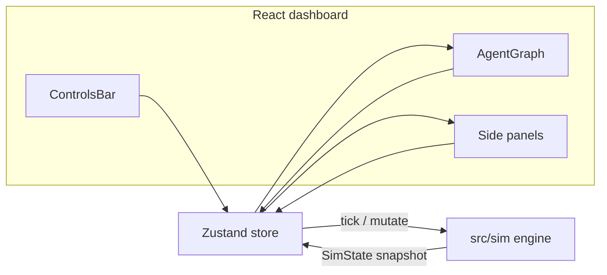

# Architecture

The product is a **browser-only** multi-agent simulator. There is no API and no database. A deterministic TypeScript engine owns world state; React is a dashboard over snapshots of that state.

## Layers

| Layer | Path | Rule |
| --- | --- | --- |
| Domain | `src/sim/` | Pure functions. Seeded RNG. Vitest without a browser. |
| Adapter | `src/store/useAppStore.ts` | Holds the live `SimState`, publishes clones, maps UI actions to engine calls. |
| View | `src/components/`, `src/App.tsx` | Renders the last snapshot. The 400 ms interval in `App` only calls `store._applyTick()` while `running` is true. |

The engine is the source of truth. Components never write `sim.agents[id].energy = …`. They call store methods (`play`, `createAgent`, `triggerEvent`, …) which call engine functions (`tick`, `addAgent`, `injectEvent`, …).

## Tick loop

1. Apply queued external events (shortage, market shift, agent failure).
2. Spawn tasks using market demand as a rate multiplier.
3. Each agent: recover, claim a role-matched task, or work (progress, energy, fail chance).
4. On completion: raise skill, pay budget, send a message along a graph edge.
5. Recompute metrics (throughput over the last 10 ticks, average skill, uptime).

Base interval is **400 ms / speed**. Speed is 1×, 2×, 4×, or 8×. **Step** runs one `tick()` while paused.

## Domain model

- **Agents** — role, skill (0–1), energy (0–100), status (`idle` · `working` · `communicating` · `failed` · `recovering`).
- **Tasks** — type matches a role (`code`, `research`, `trade`, `monitor`, `create`, `review`).
- **Connections** — directed edges; messages (`handoff`, `help_request`, `critique`, `alert`, `boost`, `status`) travel on them.
- **Resources** — shared compute, energy, budget, market demand.
- **Scenarios** — serialized agent graph (names, roles, skill, positions, edges) in `localStorage`. Runtime tick, tasks, and logs are **not** persisted.

## Why the split

The interesting behavior is the collective, not the widgets. Isolating `src/sim/` means:

- rules can be tested in Node in milliseconds
- the dashboard can be replaced without rewriting the world
- seeded runs stay reproducible (`createSim({ seed })`, `createDefaultCollective(seed)`)

## Hosting

Static Vite output in `dist/`. SPA fallback is in `vercel.json`. Base path is configurable for a `/multi-agent/` subpage — see [deployment](./deployment.md).
