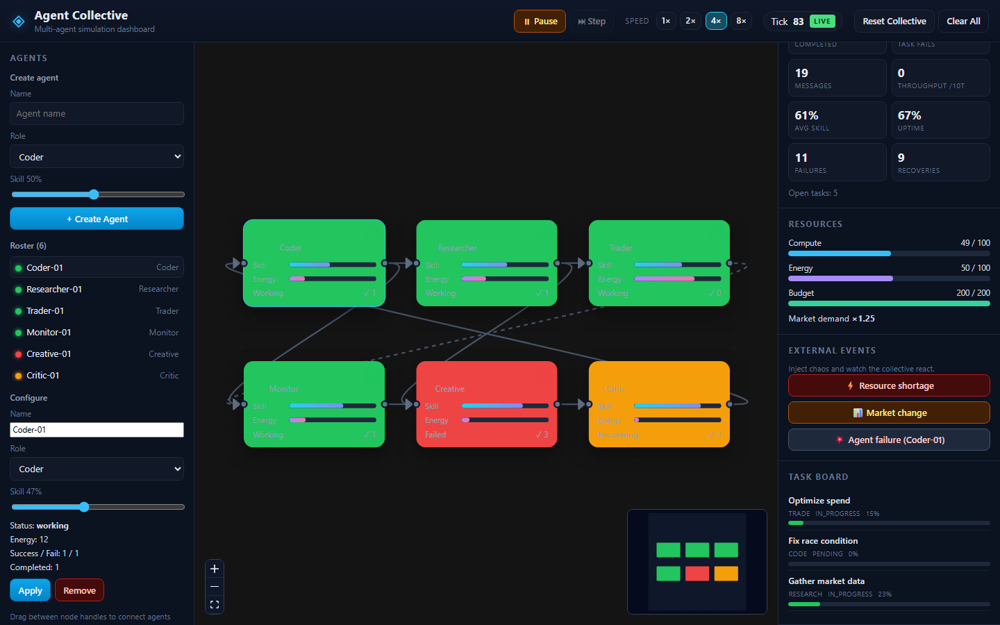
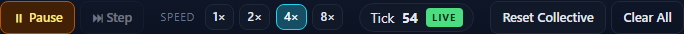
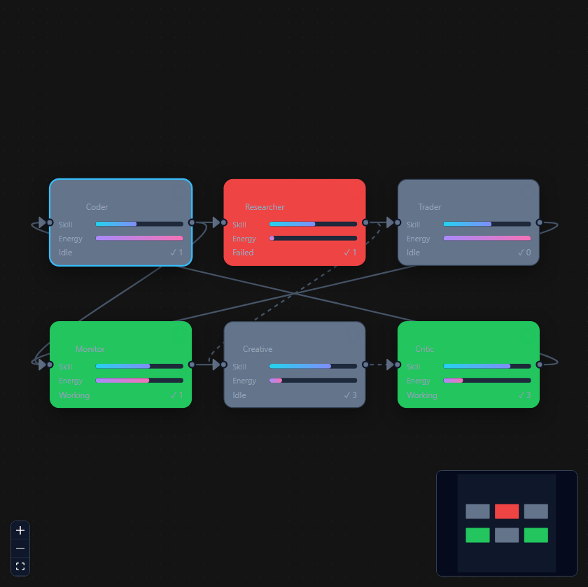
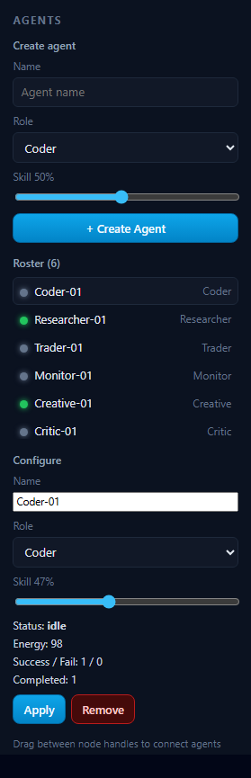
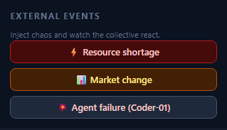
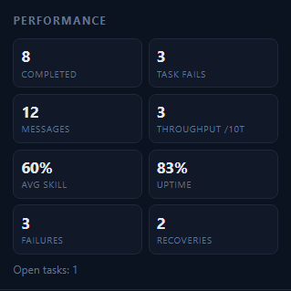
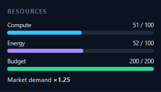
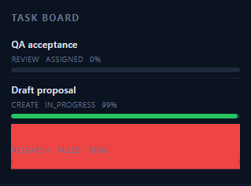

# Using the simulator

The app is a single-page dashboard. The default scenario loads six agents (one per role) already linked in a ring plus a few cross connections. The clock starts **paused** at tick `0`.

## Layout

| Area | What it does |
| --- | --- |
| Top bar | Play / pause / step, speed, tick, reset or clear |
| Left sidebar | Create agents, roster, configure, save/load scenarios |
| Center canvas | Live node graph |
| Right sidebar | Metrics, resources, chaos events, task board, live log |

## Run the clock

1. **Play** starts the loop (~400 ms per tick at 1×).
2. **1× / 2× / 4× / 8×** changes the interval.
3. **Pause** freezes the world so you can inspect it.
4. **Step** (paused only) advances exactly one tick.
5. **Reset Collective** reloads the default six-role setup. **Clear All** starts empty.

While running, idle agents pick matching tasks, spend energy and compute, talk across edges, fail and recover, and raise skill on success.

## Graph

| Cue | Meaning |
| --- | --- |
| Grey node | Idle |
| Green node | Working |
| Blue outline | Selected |
| Animated edge | A message in the last two ticks |
| Roster status dot | Same status as the node |

- Click a node or a roster name to select it.
- Drag a node to rearrange. Positions are stored with the scenario.
- Drag from a handle (left = input, right = output) onto another node to connect them.
- Select an edge and press Delete to disconnect.
- Use + / − / fit and the minimap to navigate.

## Agents

Roles map 1:1 to task types.

| Role | Task type |
| --- | --- |
| Coder | `code` |
| Researcher | `research` |
| Trader | `trade` |
| Monitor | `monitor` |
| Creative | `create` |
| Critic | `review` |

- **Create** — name, role, starting skill, then **+ Create Agent**.
- **Configure** — select an agent, edit name / role / skill, **Apply**.
- **Remove** deletes the agent and its connections.

Skill starts between 10% and 95% and rises on success. Energy is spent while working and recovers while idle or recovering.

## External events

Events are queued immediately and applied on the **next** tick.

| Event | Effect |
| --- | --- |
| **Resource shortage** | Cuts shared compute and energy (~35%) |
| **Market change** | Raises market demand (more tasks) and budget |
| **Agent failure** | Fails the selected agent, or a random one. Drops the current task and recovers over a few ticks |

## Dashboard

- **Performance** — completed / failed tasks, messages, throughput (last 10 ticks), average skill, uptime, failures, recoveries.
- **Resources** — shared pools the tick loop spends and restores.
- **Task board** — latest tasks. Empty until you press Play.
- **Live log** — newest first (`system`, `info`, `warn`, `error`, `success`).

## Scenarios

Setups persist in **browser localStorage** on this origin only. A scenario stores names, roles, skill, positions, and connections — not the live tick, tasks, or log.

1. Name the setup and click **Save setup**.
2. **Load** restores it and pauses the clock.
3. **✕** deletes a saved row.

## Suggested first run

1. Leave the default collective as-is. Press **Play**, then **4×**.
2. Watch nodes flip to **Working** and the task board fill.
3. Select **Coder-01** and click **Agent failure (Coder-01)**. It should fail, drop work, then recover.
4. Fire **Resource shortage** and watch compute / energy drop.
5. Save the layout, **Reset Collective**, then **Load** it back.
